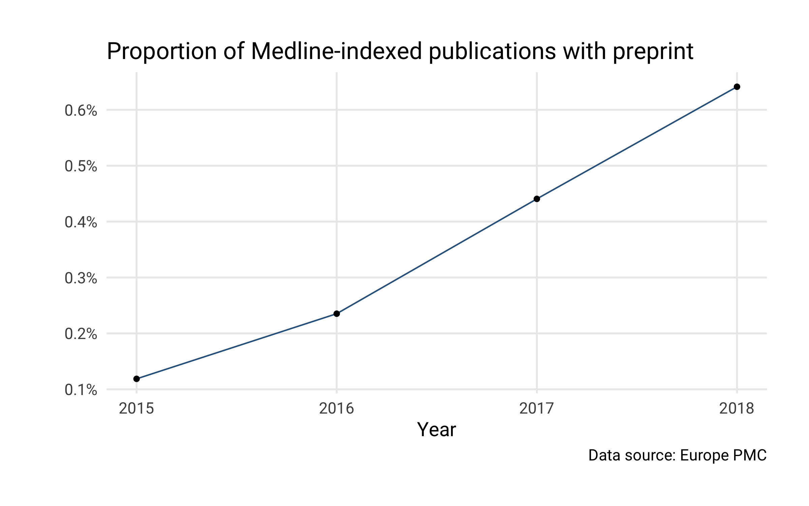

### Proportion of Medline-indexed publications with preprint


```r
library(europepmc)
library(tidyverse)
library(scales)
```

Obtain journal articles where also a preprint is indexed in Europe PMC


```r
my_df <- europepmc::epmc_hits_trend("HAS_PREPRINT:Y", data_src = "med", period = 2015:2018)
```

Data


```r
my_df
#> # A tibble: 4 x 3
#>    year all_hits query_hits
#>   <int>    <dbl>      <dbl>
#> 1  2015  1093958       1299
#> 2  2016  1100838       2590
#> 3  2017  1119227       4932
#> 4  2018   599776       3846
```

Plot


```r
my_df %>%
  ggplot(aes(year, query_hits / all_hits)) +
  geom_line(color= "#30638E") +
  geom_point() +
  labs(x = "Year", 
       title = "Proportion of Medline-indexed publications with preprint",
       caption = "Data source: Europe PMC"
  ) +
  scale_y_continuous("", labels = scales::percent) +
  theme_minimal(base_family="Roboto", base_size = 14) +
  theme(plot.margin = margin(30, 30, 30, 30)) +
  theme(panel.grid.minor = element_blank()) +
  theme(axis.ticks = element_blank()) +
  theme(panel.border = element_blank())
```



