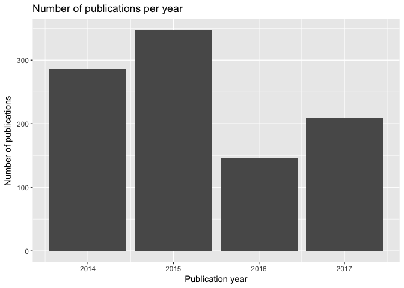
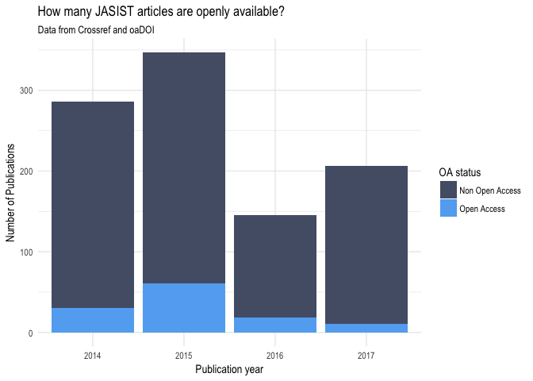

# Report Open Access status JASIST
Anne Hein  


## Introduction

@Piwowar2017 investigated the Open Access (OA) status of scholarly literature. They examined three samples of 100 000 articles each chosen from three populations, namely journal articles assigned a Crossref DOI, recent journal articles indexed in Web of Science, and articles viewed by users of Unpaywall. They estimate that at least 28 % of all scientific publications is OA, for the year 2015 they even obtain that almost half (45%) of the articles is OA.

In this brief report I investigated all articles with Crossref DOI published in the [Journal of the Association for Information Science and Technology (JASIST)](http://onlinelibrary.wiley.com/journal/10.1002/(ISSN)2330-1643) in the years from 2014 to 2017 with respect to their OA status.

To this end, I first imported the metadata of the articles published in JASIST between 2014 and 2017 using the rcrossref package by @CrossrefPack and determined the total number of publications in each of the four years. In a second step I used the roadoi package by @RoadoiPack to examine which of the articles are OA.

## Gathering bibliographic metadata

In this first step I used the `rcrossref::cr_works()` function to find the metadata of all articles published in JASIST (ISSN-Number: 2330-1635) which have a publication date between 1st of January 2014 and the 31st of December 2017. 


```r
library(rcrossref)
metadata <- rcrossref::cr_works(
  filter = c(
    from_pub_date = "2014-01-01",
    until_pub_date = "2017-12-31",
    issn = "2330-1635"
    ),
  limit = 1000
)
metadata
```

```
## $meta
##   total_results search_terms start_index items_per_page
## 1           988           NA           0           1000
## 
## $data
## # A tibble: 988 x 33
##    alternative.id archive
##             <chr>   <chr>
##  1                Portico
##  2                Portico
##  3                Portico
##  4                Portico
##  5                Portico
##  6                Portico
##  7                Portico
##  8                Portico
##  9                   <NA>
## 10                Portico
## # ... with 978 more rows, and 31 more variables: container.title <chr>,
## #   created <chr>, deposited <chr>, DOI <chr>, funder <list>,
## #   indexed <chr>, ISBN <chr>, ISSN <chr>, issue <chr>, issued <chr>,
## #   license_date <chr>, license_URL <chr>, license_delay.in.days <chr>,
## #   license_content.version <chr>, link <list>, member <chr>, page <chr>,
## #   prefix <chr>, publisher <chr>, reference.count <chr>, score <chr>,
## #   source <chr>, subject <chr>, title <chr>, type <chr>, URL <chr>,
## #   volume <chr>, assertion <list>, author <list>,
## #   `clinical-trial-number` <list>, subtitle <chr>
## 
## $facets
## NULL
```

I determined the number of articles published in each year. The results are displayed in the following figure.


```r
library(dplyr)
library(ggplot2)
metadata$data %>%
  mutate(issued, issued = lubridate::parse_date_time(issued, c('y', 'ymd', 'ym'))) %>%
  mutate(issued, issued = lubridate::year(issued)) %>%
  group_by(issued) %>%
  summarize(pubs = n())  %>%
  # arrange(desc(pubs))
  ggplot(aes(issued, pubs)) + geom_bar(stat = "identity") + labs(title = "Number of publications per year", x  ="Publication year", y = "Number of publications")
```



## Availability of Open Access full text versions

In a second step, I applied the `roadoi::oadoi_fetch()` function to examine for which of the dois an Open Access full text version can be found by the oaDOI search engine.


```r
library(roadoi)
oa_df <- roadoi::oadoi_fetch(dois = metadata$data$DOI, 
                             email = "anne.hein@mathematik.uni-goettingen.de")
oa_df
```

```
## # A tibble: 984 x 13
##                             doi best_oa_location      oa_locations
##                           <chr>           <list>            <list>
##  1            10.1002/asi.23792 <tibble [1 x 1]>  <tibble [0 x 0]>
##  2            10.1002/asi.23860 <tibble [1 x 1]>  <tibble [0 x 0]>
##  3            10.1002/asi.23565 <tibble [1 x 1]>  <tibble [0 x 0]>
##  4            10.1002/asi.23355 <tibble [1 x 1]>  <tibble [0 x 0]>
##  5            10.1002/asi.23410 <tibble [1 x 1]>  <tibble [0 x 0]>
##  6            10.1002/asi.23302 <tibble [1 x 9]> <tibble [2 x 10]>
##  7            10.1002/asi.23456 <tibble [1 x 9]> <tibble [2 x 10]>
##  8            10.1002/asi.23423 <tibble [1 x 1]>  <tibble [0 x 0]>
##  9 10.1002/asi.2015.66.issue-10 <tibble [1 x 1]>  <tibble [0 x 0]>
## 10            10.1002/asi.23881 <tibble [1 x 1]>  <tibble [0 x 0]>
## # ... with 974 more rows, and 10 more variables: data_standard <int>,
## #   is_oa <lgl>, journal_is_oa <lgl>, journal_issns <chr>,
## #   journal_name <chr>, publisher <chr>, title <chr>, year <chr>,
## #   updated <chr>, non_compliant <list>
```

The following figure displays the number of articles that are OA and not OA, resp.


```r
oa_df %>%
  group_by(is_oa, year) %>%
  summarize(oa = n()) %>%
  ggplot(aes(year, oa, fill = is_oa)) + 
  geom_bar(stat = "identity") + 
  labs(title = "How many JASIST articles are openly available?", 
       subtitle = "Data from Crossref and oaDOI",
       x = "Publication year", 
       y = "Number of Publications") +
  scale_fill_manual(name = "OA status", values = c("#545E75", "#63ADF2") , labels = c("Non Open Access", "Open Access")) +
  theme_minimal(base_family="Arial Narrow")
```

<!-- -->

Apparently, for the JASIST the percentage of articles that are OA is much lower than the estimated overall percentage of OA articles from @Piwowar2017. Furthermore, the percentage of OA articles decreased, especially for the last year.

## Acknowledgement

I thank Birgit Schmidt for offering me the internship during which I wrote this report and I especially thank Najko Jahn for showing me how to use R Markdown and for revising my work.

## Session Info


```r
sessionInfo()
```

```
## R version 3.4.2 (2017-09-28)
## Platform: x86_64-apple-darwin15.6.0 (64-bit)
## Running under: OS X El Capitan 10.11.6
## 
## Matrix products: default
## BLAS: /Library/Frameworks/R.framework/Versions/3.4/Resources/lib/libRblas.0.dylib
## LAPACK: /Library/Frameworks/R.framework/Versions/3.4/Resources/lib/libRlapack.dylib
## 
## locale:
## [1] de_DE.UTF-8/de_DE.UTF-8/de_DE.UTF-8/C/de_DE.UTF-8/de_DE.UTF-8
## 
## attached base packages:
## [1] stats     graphics  grDevices utils     datasets  methods   base     
## 
## other attached packages:
## [1] roadoi_0.4           bindrcpp_0.2         ggplot2_2.2.1       
## [4] dplyr_0.7.4          rcrossref_0.7.0.9410
## 
## loaded via a namespace (and not attached):
##  [1] Rcpp_0.12.13     highr_0.6        compiler_3.4.2   plyr_1.8.4      
##  [5] bindr_0.1        tools_3.4.2      digest_0.6.12    lubridate_1.6.0 
##  [9] jsonlite_1.5     evaluate_0.10.1  tibble_1.3.4     gtable_0.2.0    
## [13] pkgconfig_2.0.1  rlang_0.1.2.9000 bibtex_0.4.2     shiny_1.0.5     
## [17] crul_0.4.0       curl_3.0         yaml_2.1.14      httr_1.3.1      
## [21] stringr_1.2.0    knitr_1.16       xml2_1.1.1       triebeard_0.3.0 
## [25] rprojroot_1.2    grid_3.4.2       glue_1.1.1       R6_2.2.2        
## [29] rmarkdown_1.6    tidyr_0.7.2      purrr_0.2.4      magrittr_1.5    
## [33] scales_0.5.0     backports_1.1.0  urltools_1.6.0   codetools_0.2-15
## [37] htmltools_0.3.6  assertthat_0.2.0 colorspace_1.3-2 mime_0.5        
## [41] xtable_1.8-2     httpuv_1.3.5     labeling_0.3     stringi_1.1.5   
## [45] miniUI_0.1.1     lazyeval_0.2.0   munsell_0.4.3
```


## References

