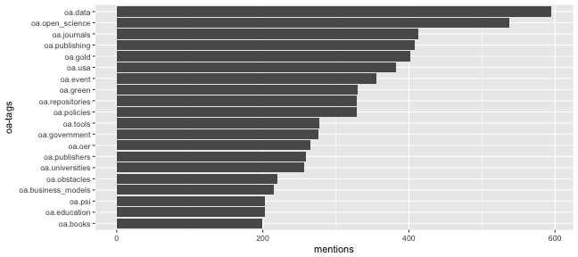

### Gathering Topis from the Open Access Tracking Project
Required Libraries


```r
require(dplyr)
require(ggplot2)
require(httr)
require(jsonlite)
require(knitr)
```

Fetching the tags


```r
u <- "http://tagteam.harvard.edu/hubs/oatp/items.json"
req <- httr::GET(u) %>%
  httr::content("text") %>%
  jsonlite::fromJSON()

tt <- plyr::ldply(1:100, function(x) {
  u <- paste0("http://tagteam.harvard.edu/hubs/oatp/items.json?page=", x)
  req <- httr::GET(u) %>%
    httr::content("text") %>%
    jsonlite::fromJSON()
  req$feed_items$tags
})
```

Summarize the data and exclude `oa.new`


```r
count_data <- tt %>%
  unlist %>%
  as_data_frame() %>%
  group_by(value) %>%
  count(sort = TRUE) %>% 
  mutate(prop = n / sum(n)) %>%
  filter(!value == "oa.new")
```

Table


```r
count_data %>% 
  head(20) %>%
  knitr::kable()
```


|value              |   n|      prop|
|:------------------|---:|---------:|
|oa.data            | 595| 0.0275629|
|oa.open_science    | 537| 0.0248761|
|oa.journals        | 413| 0.0191319|
|oa.publishing      | 408| 0.0189003|
|oa.gold            | 402| 0.0186223|
|oa.usa             | 382| 0.0176958|
|oa.event           | 355| 0.0164451|
|oa.green           | 330| 0.0152870|
|oa.policies        | 329| 0.0152407|
|oa.repositories    | 329| 0.0152407|
|oa.tools           | 277| 0.0128318|
|oa.government      | 276| 0.0127855|
|oa.oer             | 265| 0.0122759|
|oa.publishers      | 259| 0.0119980|
|oa.universities    | 257| 0.0119053|
|oa.obstacles       | 220| 0.0101913|
|oa.business_models | 215| 0.0099597|
|oa.education       | 203| 0.0094038|
|oa.psi             | 203| 0.0094038|
|oa.books           | 199| 0.0092185|

Bar chart


```r
ggplot(count_data[1:20,], aes(reorder(value, n), n)) +
  geom_bar(stat = "identity") +
  coord_flip() +
  xlab("oa-tags") +
  ylab("mentions")
```



