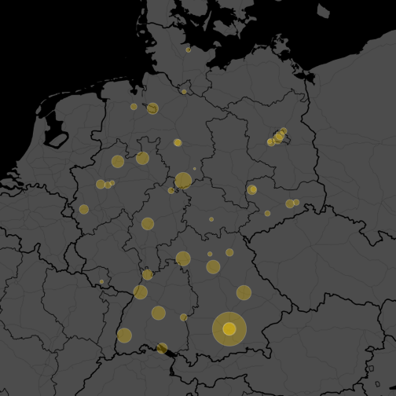

## Analyzing German spending on open access publication fees
Required libraries:


```r
library(dplyr)
```

### Create a map of financially supported open access articles per institution
Load mapping of Open APC institutions with GRID ids


```r
institutions <- readr::read_csv("data/institutions.csv")
```

fetch lat/lon from sub goe docker container, 
see <https://github.com/subugoe/r-recipes/blob/master/solr_grid/solr_grid.md>


```r
solrium::solr_connect("localhost:8983/solr/grid/select",
                      errors = "complete",
                      verbose = FALSE)
#> <solr_connection>
#>   url:    http://localhost:8983/solr/grid/select
#>   errors: complete
#>   verbose: FALSE
#>   proxy:
de_institutions <- institutions %>%
  filter(country == "DEU")
my_gc <- 
  plyr::ldply(de_institutions$grid, function(x)
    solrium::solr_search(q = paste0("id:", x))) %>%
  as_data_frame() 
my_gc
#> # A tibble: 42 × 24
#>                                                                     name
#>                                                                    <chr>
#> 1                                                  University of Bamberg
#> 2                                                   Bielefeld University
#> 3                                           University of Duisburg-Essen
#> 4                                              Free University of Berlin
#> 5  Helmholtz Centre Potsdam - GFZ German Research Centre for Geosciences
#> 6                                                 University of Konstanz
#> 7                                                  University of Leipzig
#> 8                                             Max Planck Digital Library
#> 9                                               University of Regensburg
#> 10                                    Clausthal University of Technology
#> # ... with 32 more rows, and 23 more variables: wikipedia_url <chr>,
#> #   links <chr>, types <chr>, lat <chr>, lng <chr>, city <chr>,
#> #   country <chr>, country_code <chr>, geonames_id <chr>, id <chr>,
#> #   status <chr>, established <int>, ISNI <chr>, OrgRef <chr>,
#> #   Wikidata <chr>, `_version_` <dbl>, state <chr>, state_code <chr>,
#> #   FundRef <chr>, relationship <chr>, relationship_id <chr>,
#> #   aliases <chr>, acronyms <chr>
```

Merge with Open APC dataset


```r
u <- "https://raw.githubusercontent.com/OpenAPC/openapc-de/79f20bd95f980e5974438f94cfc8cd51304c95ab/data/apc_de.csv"
apc_de <- readr::read_csv(u) %>%
  right_join(de_institutions, by = "institution") %>%
  right_join(my_gc, by = c("grid" = "id")) %>%
  mutate(lng = as.numeric(lng)) %>%
  mutate(lat = as.numeric(lat)) %>%
  # GRID wrongly places the Leibniz Foundation headquarter to beautiful Brandenburg, 
  # but there based in Berlin Mitte, so let's fix it
  mutate(lat = replace(lat, institution == "Leibniz-Fonds", 52.5306806)) %>%
  mutate(lng = replace(lng, institution == "Leibniz-Fonds", 13.3802093))
```

Prepare data frame for plotting


```r
apc_to_plot <- apc_de %>%
  group_by(institution, lat, lng) %>%
  count(institution)
```

Plot


```r
library(ggplot2)
library(ggmap)
library(scales)
my_map <- qmap("germany", zoom = 6, maptype = "toner-background", , darken = .7, source = "stamen")
my_map + 
  geom_point(data = apc_to_plot, aes(lng, lat, size = n), alpha = 30/100, fill = "gold", 
             shape = 21, color = "grey90") + 
  scale_size_continuous(range = c(1, 20)) + 
  theme(strip.background = element_blank()) +
  theme(legend.position = "none")
```



### Analyze spending over fully and hybrid open access journals


```r
apc_de %>% 
  group_by(is_hybrid) %>%
  count() %>%
  mutate(prop = round(n / sum(n) * 100, 2)) %>%
  knitr::kable()
```


|is_hybrid |     n|  prop|
|:---------|-----:|-----:|
|FALSE     | 10547| 99.03|
|TRUE      |   103|  0.97|

### Create a summary table institutional spending on articles published in open access journals
The following table summaries institutional spending on articles published in open access journals.


```r
apc_de %>% 
  select(institution, euro) %>% 
  group_by(institution) %>% 
  ezsummary::ezsummary(n = TRUE , digits= 0, median = TRUE,
                       extra = c(
                         sum = "sum(., na.rm = TRUE)",
                         min = "min(., na.rm = TRUE)",
                         max = "max(., na.rm = TRUE)"
                       )) %>% 
  mutate(proportion = round(n / sum(n) * 100, 2)) %>% 
  ezsummary::ezmarkup('...[. (.)]..[. - .].') %>% 
  # format(big.mark=',') %>%
  # get rid of blanks in combination with big.mark
  mutate(`mean (sd)` = gsub("\\(  ", "(", .$`mean (sd)`)) %>% 
  select(institution, n, proportion, sum, `mean (sd)`, median, `min - max`) %>%
  arrange(desc(n)) %>%
  knitr::kable(col.names = c("Institution", "Articles", "Proportion", "Spending total (in €)", "Mean (SD)", "Median", "Minimum - Maximum"), align = c("l","r", "r", "r", "r", "r", "r"))
```


|Institution                                 | Articles| Proportion| Spending total (in €)|   Mean (SD)| Median| Minimum - Maximum|
|:-------------------------------------------|--------:|----------:|---------------------:|-----------:|------:|-----------------:|
|MPG                                         |     3089|      29.00|               4016827|  1300 (464)|   1184|         69 - 7419|
|Goettingen U                                |      650|       6.10|                883918|  1360 (476)|   1354|        180 - 4695|
|Regensburg U                                |      484|       4.54|                652522|  1348 (564)|   1254|         77 - 4403|
|Freiburg U                                  |      471|       4.42|                626480|  1330 (410)|   1386|         50 - 2474|
|Wuerzburg U                                 |      469|       4.40|                595119|  1269 (416)|   1266|          0 - 2514|
|KIT                                         |      428|       4.02|                524346|  1225 (526)|   1239|         69 - 3731|
|Tuebingen U                                 |      411|       3.86|                548124|  1334 (407)|   1346|        150 - 2662|
|Erlangen Nuernberg U                        |      402|       3.77|                551812|  1373 (369)|   1424|        124 - 2286|
|Muenchen LMU                                |      365|       3.43|                463491|  1270 (296)|   1299|        496 - 2023|
|Bielefeld U                                 |      349|       3.28|                437899|  1255 (336)|   1276|          0 - 2380|
|Münster U                                   |      323|       3.03|                379974|  1176 (437)|   1167|        168 - 2380|
|Giessen U                                   |      317|       2.98|                428690|  1352 (575)|   1273|         81 - 4498|
|TU Muenchen                                 |      308|       2.89|                390086|  1267 (479)|   1386|        131 - 2122|
|Bremen U                                    |      264|       2.48|                335873|  1272 (425)|   1246|        112 - 2657|
|Konstanz U                                  |      223|       2.09|                304182|  1364 (407)|   1342|         40 - 2072|
|Heidelberg U                                |      215|       2.02|                308348|  1434 (377)|   1500|         60 - 2042|
|FU Berlin                                   |      175|       1.64|                238025|  1360 (503)|   1392|        150 - 2142|
|Leipzig U                                   |      173|       1.62|                243873|  1410 (331)|   1471|        341 - 2055|
|FZJ - ZB                                    |      158|       1.48|                196869|  1246 (516)|   1177|        370 - 3700|
|Duisburg-Essen U                            |      148|       1.39|                181055|  1223 (374)|   1212|        238 - 2800|
|TU Dresden                                  |      130|       1.22|                175723|  1352 (416)|   1415|        200 - 2193|
|Leibniz-Fonds                               |      129|       1.21|                208581|  1617 (708)|   1572|         66 - 4403|
|GFZ-Potsdam                                 |      106|       1.00|                126520|  1194 (760)|   1065|        223 - 4403|
|Bayreuth U                                  |       92|       0.86|                105725|  1149 (532)|   1200|         82 - 2059|
|Ulm U                                       |       78|       0.73|                117982|  1513 (694)|   1360|        260 - 5284|
|TiHo Hannover                               |       73|       0.69|                 98304|  1347 (551)|   1396|        196 - 3115|
|Bochum U                                    |       71|       0.67|                 93546|  1318 (460)|   1438|        100 - 2042|
|Hannover U                                  |       69|       0.65|                 90259|  1308 (414)|   1241|        149 - 2159|
|MDC                                         |       69|       0.65|                145256| 2105 (1228)|   1800|        491 - 4700|
|Oldenburg U                                 |       59|       0.55|                 63175|  1071 (480)|   1247|         63 - 1757|
|Kassel U                                    |       55|       0.52|                 59511|  1082 (545)|   1129|        150 - 2321|
|HZDR                                        |       52|       0.49|                 60183|  1157 (852)|    982|        344 - 3700|
|TU Chemnitz                                 |       41|       0.38|                 39554|   965 (702)|   1012|         78 - 2123|
|UFZ                                         |       40|       0.38|                 42186|  1055 (404)|    979|        232 - 2291|
|Dortmund TU                                 |       29|       0.27|                 27991|   965 (927)|    900|        155 - 4403|
|IPN                                         |       26|       0.24|                 57512|  2212 (832)|   2558|        330 - 3540|
|Hamburg TUHH                                |       24|       0.23|                 32789|  1366 (499)|   1466|        300 - 2027|
|Potsdam U                                   |       24|       0.23|                 32128|  1339 (236)|   1386|        916 - 2116|
|Bamberg U                                   |       22|       0.21|                 23663|  1076 (563)|   1009|         90 - 2010|
|TU Ilmenau                                  |       17|       0.16|                 18540|  1091 (594)|   1046|        178 - 2077|
|INM - Leibniz-Institut für Neue Materialien |       14|       0.13|                 32764| 2340 (1133)|   2264|        237 - 3861|
|TU Clausthal                                |        8|       0.08|                  6999|   875 (514)|    918|        181 - 1724|

