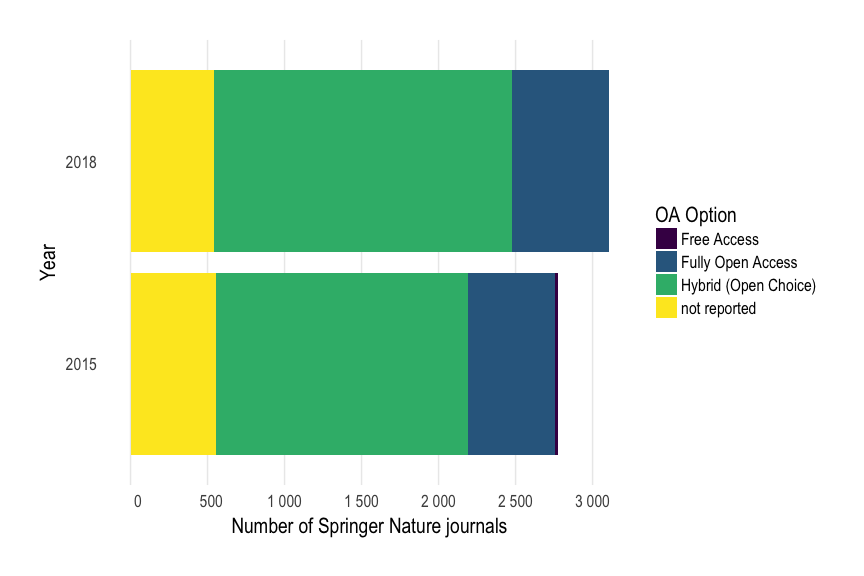

Journals flipped by Springer Nature between 2015 and 2018
================

The aim of this document is to examine how many journals published by
Springer Nature changed their business model between 2015 - 2018.

## Methods and Data

[Bernd-Christoph
Kämper](https://twitter.com/bckaemper/status/993477985327108101) from
Stuttgart University Library pointed me to [this catalogue of journals
offered by Springer Nature to
librarians](https://www.springernature.com/gp/librarians/licensing/journals-price-list).
Let’s obtain the journal spreadsheets for 2015 and 2018, and load them
into R.

``` r
library(tidyverse)
library(rio)
library(viridis)
sn_2018 <-
  rio::import("https://resource-cms.springernature.com/springer-cms/rest/v1/content/15226614/data/v7", skip = 8) %>%
  as_data_frame() %>%
  # add year column
  mutate(file_year = 2018)
sn_2015 <- rio::import("https://resource-cms.springernature.com/springer-cms/rest/v1/content/10619914/data/v1", skip = 8) %>%
  as_data_frame() %>%
  # add year column
  mutate(file_year = 2015)
# let's bind them
bind_rows(sn_2018, sn_2015) -> my_data
my_data
#> # A tibble: 5,878 x 14
#>    product_title_so… Title Format product_id `ISSN print` `ISSN electroni…
#>    <chr>             <chr> <chr>       <dbl> <chr>        <chr>           
#>  1 3 Biotech         3 Bi… E C         13205 <NA>         2190-5738       
#>  2 3D Printing Medi… 3D P… E OA C      41205 <NA>         2365-6271       
#>  3 3D Research       3D R… E C         13319 <NA>         2092-6731       
#>  4 3D-Printed Mater… 3D-P… OA C        40861 <NA>         2363-8389       
#>  5 4OR               4OR   PE OF       10288 1619-4500    1614-2411       
#>  6 AAPS Journal      The … E OF S      12248 <NA>         1550-7416       
#>  7 AAPS Open         AAPS… E OA …      41120 <NA>         2364-9534       
#>  8 AAPS PharmSciTech AAPS… E OF S      12249 <NA>         1530-9932       
#>  9 Abdominal Radiol… Abdo… E OF S        261 <NA>         2366-0058       
#> 10 Abhandlungen Mat… Abha… PE OF…      12188 0025-5858    1865-8784       
#> # ... with 5,868 more rows, and 8 more variables: Imprint <chr>, `Primary
#> #   Language` <chr>, `Vols Qty` <dbl>, `Scheduled Vol Nos` <chr>, `Single
#> #   Issues per volume` <dbl>, `Open Access Option` <chr>, Comment <chr>,
#> #   file_year <dbl>
```

To get flipped journals, we will examine which journals changed their
open access business model.

``` r
my_data %>%
  distinct(`Open Access Option`, Title) %>%
  group_by(Title) %>%
  filter(!is.na(`Open Access Option`)) %>%
  filter(n() > 1) -> flipped_jns
```

## Results

The following figure displays the number of journals and their
underlying business model.

``` r
my_data %>%
  count(file_year, `Open Access Option`) %>% 
  # remove NAs
  mutate(`Open Access Option` = ifelse(is.na(`Open Access Option`), "not reported", `Open Access Option`)) %>%
  ggplot(aes(factor(file_year), n, fill = `Open Access Option`)) + 
  geom_bar(stat = "identity") +
  coord_flip() +
  scale_x_discrete(drop = FALSE) +
  viridis::scale_fill_viridis("OA Option", discrete = TRUE) +
  scale_y_continuous(labels=function(x) format(x, big.mark = " ", scientific = FALSE),
                       breaks= scales::pretty_breaks()) +
  # mimicking github.com/hrbrmstr/hrbrthemes 
  theme_minimal(base_family="Arial Narrow", base_size = 16) +
  theme(plot.margin=margin(30,30,30,30)) +
  theme(panel.grid.minor=element_blank()) +
  theme(axis.ticks=element_blank()) +
  theme(panel.grid.major.y=element_blank()) +
  theme(panel.border=element_blank()) +
  xlab("Year") +
  ylab("Number of Springer Nature journals")
```

<!-- -->

Apparently, both the total number of journals and the number of hybrid
open access journals increased between 2015 - 2018. Hybrid open access
is still the dominant business model for Springer Nature journals.

We also asked about journals were the business model changed over the
year. The following table summarizes the open access status for these
flipped journals in 2018:

``` r
sn_2018 %>%
  filter(Title %in% flipped_jns$Title) %>%
  count(`Open Access Option`) %>%
  knitr::kable()
```

| Open Access Option   |  n |
| :------------------- | -: |
| Fully Open Access    |  5 |
| Hybrid (Open Choice) | 16 |

Surprisingly, more journals changed the business model to Hybrid (Open
Choice) than to fully open access, including journals like [Health
Information Science Systems](https://link.springer.com/journal/13755),
which was published under the brand “BioMed Central” in 2015, and is now
published as toll-access journal.

Here’s the list of all flipped journals with their most current open
access status:

``` r
sn_2018 %>%
  filter(Title %in% flipped_jns$Title) %>%
  select(Title, `Open Access Option`) %>%
  knitr::kable()
```

| Title                                                    | Open Access Option   |
| :------------------------------------------------------- | :------------------- |
| 3 Biotech                                                | Hybrid (Open Choice) |
| Applied Nanoscience                                      | Hybrid (Open Choice) |
| DARU Journal of Pharmaceutical Sciences                  | Hybrid (Open Choice) |
| Environmental Health and Preventive Medicine             | Fully Open Access    |
| EPMA Journal                                             | Hybrid (Open Choice) |
| Genes & Nutrition                                        | Fully Open Access    |
| Gold Bulletin                                            | Hybrid (Open Choice) |
| Gynecological Surgery                                    | Fully Open Access    |
| Health Information Science and Systems                   | Hybrid (Open Choice) |
| Helgoland Marine Research                                | Fully Open Access    |
| In Silico Pharmacology                                   | Hybrid (Open Choice) |
| Integrating Materials and Manufacturing Innovation       | Hybrid (Open Choice) |
| Journal of Diabetes & Metabolic Disorders                | Hybrid (Open Choice) |
| Journal of Environmental Health Science and Engineering  | Hybrid (Open Choice) |
| Journal for Labour Market Research                       | Fully Open Access    |
| Journal of Psychosocial Rehabilitation and Mental Health | Hybrid (Open Choice) |
| Journal of Remanufacturing                               | Hybrid (Open Choice) |
| Maritime Studies                                         | Hybrid (Open Choice) |
| Research in the Mathematical Sciences                    | Hybrid (Open Choice) |
| Research in Number Theory                                | Hybrid (Open Choice) |
| Science China Life Sciences                              | Hybrid (Open Choice) |

## Discussion and conclusion

Despite recent efforts to transition journals from a subscription-based
model to fully open access, our findings suggest that hybrid open access
is still prevalent for journals published by Springer Nature. In fact,
more journals are flipped from a fully open access to hybrid open
access, raising important questions about how to sustain fully open
access journals.

## Session info

``` r
sessionInfo()
#> R version 3.5.0 (2018-04-23)
#> Platform: x86_64-apple-darwin15.6.0 (64-bit)
#> Running under: OS X El Capitan 10.11.6
#> 
#> Matrix products: default
#> BLAS: /Library/Frameworks/R.framework/Versions/3.5/Resources/lib/libRblas.0.dylib
#> LAPACK: /Library/Frameworks/R.framework/Versions/3.5/Resources/lib/libRlapack.dylib
#> 
#> locale:
#> [1] de_DE.UTF-8/de_DE.UTF-8/de_DE.UTF-8/C/de_DE.UTF-8/de_DE.UTF-8
#> 
#> attached base packages:
#> [1] stats     graphics  grDevices utils     datasets  methods   base     
#> 
#> other attached packages:
#>  [1] bindrcpp_0.2.2    viridis_0.5.1     viridisLite_0.3.0
#>  [4] rio_0.5.10        forcats_0.3.0     stringr_1.3.0    
#>  [7] dplyr_0.7.4       purrr_0.2.4       readr_1.1.1      
#> [10] tidyr_0.8.0       tibble_1.4.2      ggplot2_2.2.1    
#> [13] tidyverse_1.2.1  
#> 
#> loaded via a namespace (and not attached):
#>  [1] reshape2_1.4.3    haven_1.1.1       lattice_0.20-35  
#>  [4] colorspace_1.3-2  htmltools_0.3.6   yaml_2.1.19      
#>  [7] utf8_1.1.3        rlang_0.2.0       pillar_1.2.2     
#> [10] foreign_0.8-70    glue_1.2.0        modelr_0.1.1     
#> [13] readxl_1.1.0      bindr_0.1.1       plyr_1.8.4       
#> [16] munsell_0.4.3     gtable_0.2.0      cellranger_1.1.0 
#> [19] rvest_0.3.2       psych_1.8.3.3     evaluate_0.10.1  
#> [22] knitr_1.20        parallel_3.5.0    curl_3.2         
#> [25] highr_0.6         broom_0.4.4       Rcpp_0.12.16     
#> [28] scales_0.5.0      backports_1.1.2   jsonlite_1.5     
#> [31] gridExtra_2.3     mnormt_1.5-5      hms_0.4.2        
#> [34] digest_0.6.15     stringi_1.1.7     openxlsx_4.0.17  
#> [37] grid_3.5.0        rprojroot_1.3-2   cli_1.0.0        
#> [40] tools_3.5.0       magrittr_1.5      lazyeval_0.2.1   
#> [43] crayon_1.3.4      pkgconfig_2.0.1   data.table_1.11.0
#> [46] xml2_1.2.0        lubridate_1.7.4   assertthat_0.2.0 
#> [49] rmarkdown_1.9     httr_1.3.1        rstudioapi_0.7   
#> [52] R6_2.2.2          nlme_3.1-137      compiler_3.5.0
```
