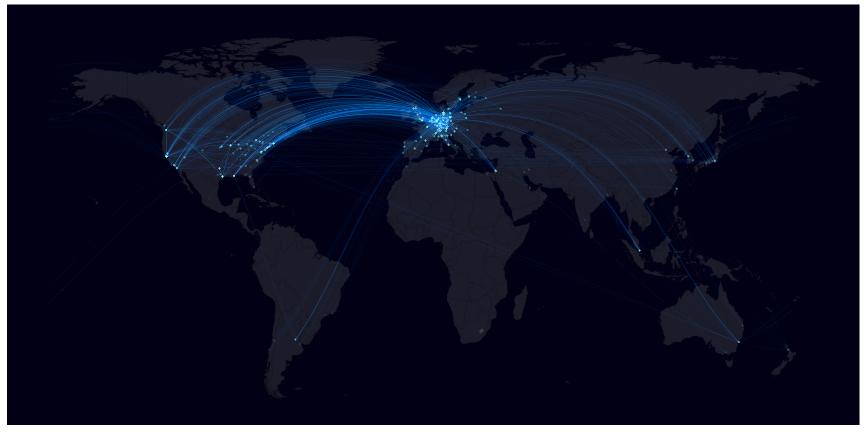

```r
library(dplyr)
```

Load dataset with publications and GRIDs


```r
grids <- readr::read_csv("grids.csv")
```

```
## Parsed with column specification:
## cols(
##   grid_id_consolidated = col_character(),
##   pub_id = col_character()
## )
```

```r
grids
```

```
## # A tibble: 4,589 × 2
##    grid_id_consolidated   pub_id
##                   <chr>    <chr>
## 1         grid.150338.c 6f1cfe54
## 2           grid.8142.f 6f1cfe54
## 3           grid.5805.8 6f1cfe54
## 4         grid.410567.1 6f1cfe54
## 5           grid.5645.2 6f1cfe54
## 6         grid.419522.9 e9913cdd
## 7           grid.1006.7 e9913cdd
## 8         grid.418140.8 e9913cdd
## 9         grid.26790.3a e9913cdd
## 10          grid.5645.2 e9913cdd
## # ... with 4,579 more rows
```

Remove NA and `not_in_grid`


```r
grids <-
  filter(grids,
         !is.na(grid_id_consolidated) &
           !grid_id_consolidated == "not_in_grid")
```

Get bipartite network, and calculate unipartite representation


```r
grids_mat <- table(grids$grid_id_consolidated, grids$pub_id)
mat_t <- grids_mat %*% t(grids_mat)
```

convert to edge list using igraph library, we want a undirected network without loops (self-links)


```r
my_net <- igraph::graph_from_adjacency_matrix(mat_t, mode = c("undirected"), diag = FALSE)
my_graph <- igraph::get.edgelist(my_net)
```

let's get geocodes using the Solr store. See also `solr_grid.r`
Call Solr API within R


```r
library(solrium)
```

Connect


```r
solrium::solr_connect("localhost:8983/solr/grid/select",
                      errors = "complete",
                      verbose = FALSE)
```

```
## <solr_connection>
##   url:    http://localhost:8983/solr/grid/select
##   errors: complete
##   verbose: FALSE
##   proxy:
```

Call


```r
my_graph_in <- plyr::ldply(my_graph[,1], function(x) solrium::solr_search(q = paste0("id:", x))) 
my_graph_out <- plyr::ldply(my_graph[,2], function(x) solrium::solr_search(q = paste0("id:", x)))
```

Remove missing geocodes


```r
p1 <- my_graph_in %>% select(lng, lat) %>% filter(!is.na(lng))
p2 <- my_graph_out %>% select(lng, lat) %>% filter(!is.na(lng))
```

convert to numeric values


```r
p1 <- sapply(p1, as.numeric) %>% dplyr::as_data_frame()
p2 <- sapply(p2, as.numeric) %>% dplyr::as_data_frame()
```

Get intermediate points (way points) between the two locations with longitude/latitude coordinates


```r
arch <- geosphere::gcIntermediate(p1,
                       p2,
                       n=50,
                       breakAtDateLine=FALSE, 
                       addStartEnd=TRUE, 
                       sp=TRUE)
```

```
## Warning in cbind(p1[, 1], p1[, 2], p2[, 1], p2[, 2], as.vector(n)): number
## of rows of result is not a multiple of vector length (arg 3)
```

http://docs.ggplot2.org/0.9.3.1/fortify.map.html


```r
arch_fortified <- plyr::ldply(arch@lines, ggplot2::fortify)
```

get world map


```r
library(ggplot2)
library(ggmap)
library(sp)
library(grid)
library(geosphere)
world <- map_data("world")
world <- world[world$region != "Antarctica",] 
```

ggplot2 code


```r
my_plot <- ggplot() +
  geom_map(data=world, map=world,
           aes(x=long, y=lat, map_id=region),
           color="#191919", fill="#7f7f7f", size=0.05, alpha=1/4) +
  geom_line(aes(long,lat,group=group), data=arch_fortified, alpha= 1/100 ,size=0.5, colour="skyblue1") +
  ggthemes::theme_map() +
  theme(strip.background = element_blank()) +
  theme(panel.background = element_rect(fill = "#01001C", colour=NA)) +
  theme(legend.position = "none") +
  geom_point(data = p1, aes(lng, lat), alpha = 1/100, size = 0.3, colour = "#B0E2FF") +
  geom_point(data = p2, aes(lng, lat), alpha = 1/100, size = 0.3, colour = "#B0E2FF") 
```

```
## Warning: Ignoring unknown aesthetics: x, y
```

export


```r
my_plot
```



```r
ggsave("network.pdf", width = 12, height = 6)
```

Europe and North America


```r
my_plot + coord_cartesian(xlim=c(-160,35),ylim=c(15,70))
```


```r
ggsave("network_na_europe.pdf", width = 12, height = 6)
```

Links
- https://github.com/ricardo-bion/medium_visualization
