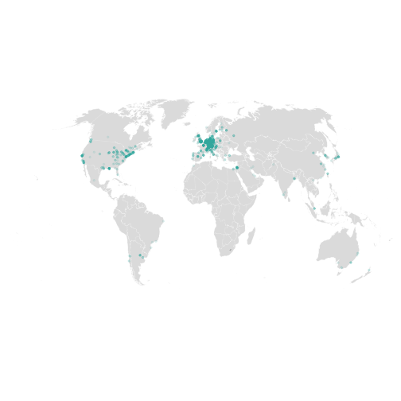

## Cleaning affiliations with GRID and Solr

It is a common strategy to use research affiliations in scholarly articles to
analyse research collaborations. Unfortunately, author addresses are often ambigue
and require a lot of cleaning. To spend less time for data-curation, we use the
[Global Research Identifier Database (GRID)](https://www.digital-science.com/products/grid/)
 to identify institutions, and to gather cross-references as well as geo coordinates.

In the following, it is described how you can use the most recent GRID data dump within R.

### Prerequisite: Run docker image

GRID has no web API to access its data, but publishes open data dumps on a regular basis.
SUB has created an Docker container that builds a local Solr index with the most recent data dump
from the Global Research Identifier Database (GRID). So we can use Solr as a super fast local
store for GRID.

Clone
- <https://github.com/subugoe/gro-solr_docker>

and follow the instructions.

### Call Solr API within R


```r
library(solrium)
```

#### Connect


```r
solrium::solr_connect("localhost:8983/solr/grid/select",
                      errors = "complete",
                      verbose = FALSE)
```

```
## <solr_connection>
##   url:    http://localhost:8983/solr/grid/select
##   errors: complete
##   verbose: FALSE
##   proxy:
```

#### Search


```r
solrium::solr_search(q = '"University of Exeter"')
```

```
## # A tibble: 4 × 21
##                                          name
##                                         <chr>
## 1                        University of Exeter
## 2                          Derriford Hospital
## 3             Royal Devon and Exeter Hospital
## 4 Peninsula College of Medicine and Dentistry
## # ... with 20 more variables: wikipedia_url <chr>, links <chr>,
## #   types <chr>, lat <chr>, lng <chr>, city <chr>, country <chr>,
## #   country_code <chr>, geonames_id <chr>, id <chr>, status <chr>,
## #   established <int>, relationship <chr>, relationship_id <chr>,
## #   ISNI <chr>, FundRef <chr>, OrgRef <chr>, Wikidata <chr>,
## #   `_version_` <dbl>, acronyms <chr>
```

All orgs from Göttingen


```r
solrium::solr_search(q = "city:Göttingen", rows = 100)
```

```
## # A tibble: 21 × 22
##                                                       name
##                                                      <chr>
## 1                                  University of Göttingen
## 2                            Universitätsmedizin Göttingen
## 3           Max Planck Institute for Biophysical Chemistry
## 4                                    German Primate Center
## 5                European Neuroscience Institute Göttingen
## 6  Max Planck Institute for Dynamics and Self Organization
## 7           Max Planck Institute for Experimental Medicine
## 8              Nordwestdeutsche Forstliche Versuchsanstalt
## 9               Northwest German Forest Research Institute
## 10                                      LaVision (Germany)
## # ... with 11 more rows, and 21 more variables: wikipedia_url <chr>,
## #   links <chr>, acronyms <chr>, types <chr>, lat <chr>, lng <chr>,
## #   city <chr>, country <chr>, country_code <chr>, geonames_id <chr>,
## #   id <chr>, status <chr>, established <int>, relationship <chr>,
## #   relationship_id <chr>, ISNI <chr>, FundRef <chr>, OrgRef <chr>,
## #   Wikidata <chr>, `_version_` <dbl>, aliases <chr>
```

### Retrieve geo-coordinates by GRID ID.
For this task, we will use a set of GRID IDs representing author affiliations. Affiliations were obtained 
from the Web of Science and semi-automatically matched with GRID IDs. Because of the Web of Science database 
licence, the Web of Science database identifier was anomized for this recipe.

#### Load dataset with GRID IDs

The dataset consist of two columns where `pub_id` represents publications and `grid_id_consolidated` affiliations (GRID ID)


```r
grids <- readr::read_csv("grids.csv")
```

```
## Parsed with column specification:
## cols(
##   grid_id_consolidated = col_character(),
##   pub_id = col_character()
## )
```

```r
grids
```

```
## # A tibble: 4,589 × 2
##    grid_id_consolidated   pub_id
##                   <chr>    <chr>
## 1         grid.150338.c 6f1cfe54
## 2           grid.8142.f 6f1cfe54
## 3           grid.5805.8 6f1cfe54
## 4         grid.410567.1 6f1cfe54
## 5           grid.5645.2 6f1cfe54
## 6         grid.419522.9 e9913cdd
## 7           grid.1006.7 e9913cdd
## 8         grid.418140.8 e9913cdd
## 9         grid.26790.3a e9913cdd
## 10          grid.5645.2 e9913cdd
## # ... with 4,579 more rows
```

Remove NA and `not_in_grid`


```r
grids <-
  filter(grids,
         !is.na(grid_id_consolidated) &
           !grid_id_consolidated == "not_in_grid")
```

#### Call local Solr API


```r
solrium::solr_search(q = 'id:grid.1006.7')
```

```
## # A tibble: 1 × 21
##                   name                                     wikipedia_url
##                  <chr>                                             <chr>
## 1 Newcastle University http://en.wikipedia.org/wiki/Newcastle_University
## # ... with 19 more variables: links <chr>, aliases <chr>, types <chr>,
## #   lat <chr>, lng <chr>, city <chr>, country <chr>, country_code <chr>,
## #   geonames_id <chr>, id <chr>, status <chr>, established <int>,
## #   relationship <chr>, relationship_id <chr>, ISNI <chr>, FundRef <chr>,
## #   OrgRef <chr>, Wikidata <chr>, `_version_` <dbl>
```

Apply over all rows and add pub_id


```r
library(dplyr)
my_gc <-
  plyr::ldply(grids$grid_id_consolidated, function(x)
    solrium::solr_search(q = paste0("id:", x))) %>%
  as_data_frame() %>%
  mutate(pub_id = grids$pub_id)
my_gc
```

```
## # A tibble: 4,152 × 25
##                                              name
##                                             <chr>
## 1                   University Hospital of Geneva
## 2         Catholic University of the Sacred Heart
## 3               Pierre and Marie Curie University
## 4                    University Hospital of Basel
## 5               Erasmus University Medical Center
## 6  Max Planck Institute for Experimental Medicine
## 7                            Newcastle University
## 8  Max Planck Institute for Biophysical Chemistry
## 9                             University of Miami
## 10              Erasmus University Medical Center
## # ... with 4,142 more rows, and 24 more variables: wikipedia_url <chr>,
## #   links <chr>, acronyms <chr>, types <chr>, lat <chr>, lng <chr>,
## #   city <chr>, country <chr>, country_code <chr>, geonames_id <chr>,
## #   id <chr>, status <chr>, established <int>, relationship <chr>,
## #   relationship_id <chr>, ISNI <chr>, FundRef <chr>, OrgRef <chr>,
## #   Wikidata <chr>, `_version_` <dbl>, state <chr>, state_code <chr>,
## #   aliases <chr>, pub_id <chr>
```


Let's explore the dataset,

Number of publications


```r
length(unique(my_gc$pub_id))
```

```
## [1] 1070
```

Number of distinct insitutions


```r
length(unique(my_gc$id))
```

```
## [1] 616
```

Calculate the number of papers per affiliation. For this purpose, we need to be aware that we only
extracted affiliations on the level of institutions, and thus not included departments. Therefore,
let's only count the unique occurrence of an affiliation per paper, `pub_distinct`.


```r
my_gc %>%
  group_by(name, id) %>%
  count(pub_distinct = n_distinct(pub_id)) %>%
  mutate(proportion = pub_distinct / n_distinct(my_gc$pub_id) * 100) %>%
  select(-n) %>%
  arrange(desc(pub_distinct)) %>%
  head(10) %>%
  knitr::kable()
```


|name                                           |id            | pub_distinct| proportion|
|:----------------------------------------------|:-------------|------------:|----------:|
|University of Göttingen                        |grid.7450.6   |          537|  50.186916|
|Max Planck Institute for Biophysical Chemistry |grid.418140.8 |          398|  37.196262|
|Universitätsmedizin Göttingen                  |grid.411984.1 |          215|  20.093458|
|Max Planck Institute for Experimental Medicine |grid.419522.9 |          135|  12.616822|
|Ludwig Maximilian University of Munich         |grid.5252.0   |           84|   7.850467|
|German Center for Neurodegenerative Diseases   |grid.424247.3 |           39|   3.644860|
|Charité                                        |grid.6363.0   |           37|   3.457944|
|University Medical Center New Orleans          |grid.470125.5 |           32|   2.990654|
|University of Freiburg                         |grid.5963.9   |           28|   2.616822|
|Heidelberg University                          |grid.7700.0   |           25|   2.336449|

### Plot map

Prepare local data frame including geo-coordinates


```r
gc_df <- my_gc %>%
  distinct()
```

Prepare world map using ggplot2 and the [ggalt](https://github.com/hrbrmstr/ggalt)-package.


```r
library(ggplot2)
library(ggalt)    # devtools::install_github("hrbrmstr/ggalt")
```

Choose world map


```r
world <- map_data("world")
```

Remove Antarctica


```r
world <- world %>%
  filter(region != "Antarctica")
```

Plot map with nice aesthetics like here https://rud.is/b/2015/12/28/world-map-panel-plots-with-ggplot2-2-0-ggalt/


```r
gg <- ggplot()
gg <- gg + geom_map(
  data = world,
  map = world,
  aes(x = long, y = lat, map_id = region),
  color = "white",
  fill = "#7f7f7f",
  size = 0.05,
  alpha = 1 / 4
)
```

```
## Warning: Ignoring unknown aesthetics: x, y
```

```r
gg <- gg + geom_point(
  data = gc_df,
  aes(x = as.numeric(lng), y = as.numeric(lat)),
  size = 0.8,
  alpha = 0.1,
  color = "#3fb0ac"
)
gg <- gg + coord_proj("+proj=wintri") +
  theme_map() +
  theme(strip.background = element_blank()) +
  theme(legend.position = "none")
gg
```

```
## Warning: Removed 9 rows containing missing values (geom_point).
```



